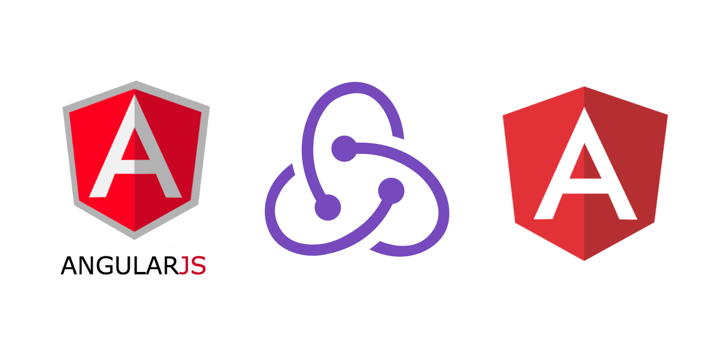

# Angular: o framework do momento

Se você estuda programação voltada para o frontend certamente já ouviu falar do [Angular](https://www.angular.io/) em algum momento. Para os amantes de Javascript, esse poderoso framework conta com uma variedade de recursos ao seu dispor para facilitar a vida do dev contando ainda com o typescript para a construção de um código mais confiável. Mas afinal, o que é o angular, de onde ele vêm, o que come ? Segue comigo e vamos descobir

## O que é o angular?

Angular é um framework JavaScript de código aberto mantido pelo Google que é usado para construir aplicativos web e móveis. Ele oferece uma estrutura para desenvolver aplicativos de página única (SPA) com base em componentes reutilizáveis. O Angular usa o TypeScript como sua linguagem principal e fornece recursos como vinculação de dados bidirecional, injeção de dependência e roteamento para criar aplicativos escaláveis e de alto desempenho.

O Angular foi originalmente desenvolvido pela equipe do Google em 2010, como um projeto interno chamado de "AngularJS". Ele foi lançado publicamente em 2012 como uma estrutura JavaScript de código aberto para desenvolvimento de aplicativos web. O AngularJS rapidamente ganhou popularidade por sua abordagem inovadora para construir aplicativos web baseados em componentes reutilizáveis e vinculação de dados bidirecional.

No entanto, com a evolução da web e as novas demandas dos desenvolvedores, o AngularJS começou a mostrar limitações. Em 2016, o Google lançou o Angular 2, uma reescrita completa do framework que abordou muitas dessas limitações e introduziu recursos como a arquitetura baseada em componentes, vinculação de dados bidirecional aprimorada e suporte para TypeScript.

Desde então, o Angular tem sido continuamente atualizado e aprimorado com recursos adicionais, tornando-se uma das estruturas de desenvolvimento web mais populares para a criação de aplicativos de página única (SPA).

### SPA? Single Page Application

SPA significa Single Page Application, ou seja, Aplicação de Página Única em português. É um tipo de aplicativo web que carrega e exibe todo o seu conteúdo em uma única página, sem a necessidade de recarregar a página inteira a cada interação do usuário. Em vez disso, o aplicativo carrega e exibe apenas as partes relevantes da página, tornando a experiência do usuário mais rápida e fluida.

O SPA é construído usando tecnologias web modernas, como JavaScript, HTML e CSS, e geralmente é implementado usando um framework como o Angular, React ou Vue.js. Os frameworks SPA oferecem recursos como vinculação de dados bidirecional, roteamento, injeção de dependência e gerenciamento de estado para criar aplicativos web escaláveis e de alto desempenho.

## Caracteristicas do Angular

Algumas características do Angular incluem:

- Arquitetura baseada em componentes que permite a criação de aplicativos modulares e reutilizáveis.
- Vinculação de dados bidirecional, que sincroniza automaticamente as alterações feitas no modelo com a interface do usuário e vice-versa.
- Injeção de dependência, que permite a criação de serviços e componentes que podem ser facilmente compartilhados em toda a aplicação.
- Uso do TypeScript como sua linguagem principal, que adiciona recursos como tipagem estática e recursos de programação orientada a objetos.
- Suporte para roteamento, que permite a criação de aplicativos com várias páginas.
- Testabilidade, com suporte para testes unitários e de integração.
- Grande comunidade de desenvolvedores e documentação abrangente.

## Opinião sobre o Angular

Tive a oportunidade de refatorar alguns projetos que fiz em React enquanto aprendia Angular, e no início a estrutura de arquivos que a CLI cria me deixou um pouco confuso, mas foi so uma questão de se acostumar mesmo. Fora que é uma preocupação a menos não ter que ficar planejando a estrutura de arquivos ou configuração do projeto como acontece quando programo em React, por outro lado eu curto bastante essa liberdade que o React traz em organizar as coisas de nossa maneira. Nesse quesito não tenho prós ou contra. Porém um ponto a levar em conta é que o Angular é um framework para projetos grandes, não da para pensar em usar o Angular em pequenos projetos que não seja necessário tanto recursos. Para esses casos uma solução mais leve como React ou Vue é o mais indicado. No fim é tudo uma questão de preferência.